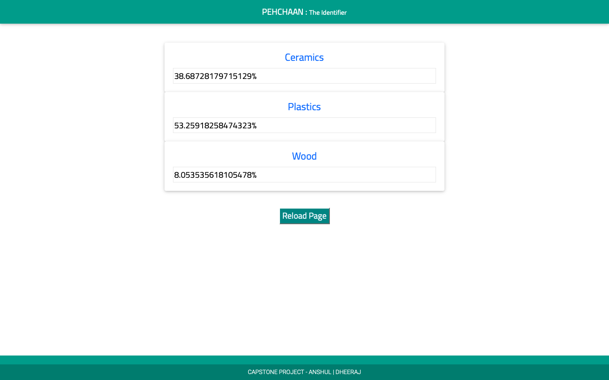

# API Interface (Flask)
The base URL for all the endpoints is: `https://improved-pancakes.herokuapp.com`

## Endpoints details
1. **[Landing page](https://improved-pancakes.herokuapp.com/)**: This is the landing page which informs us about the working status of the API.

2. **[Prediction view](https://improved-pancakes.herokuapp.com/predict?myvar="Values")**: This is the API endpoint for the prediction module. This endpoint requires values from the acquired signal which are to be separated with *comma*. The machine learning model from the PKL model file is applied and the confidence probability of the material to which the signal value can correspond to are returned. The usage is as follows:

Example:
```
https://improved-pancakes.herokuapp.com/predict?myvar=411.0,417.0,6.0,417.0,411.0,417.0,414.54,400,400
```

Response:
```js
{
  "ceramics": 0.3868728179715129, 
  "plastic": 0.5325918258474323, 
  "wood": 0.08053535618105478
}
```

3. **[Result view](https://improved-pancakes.herokuapp.com/view)**: This website is a consumer-facing application which displays the confidence values for the different materials.

<p align = "center"></img></p>
