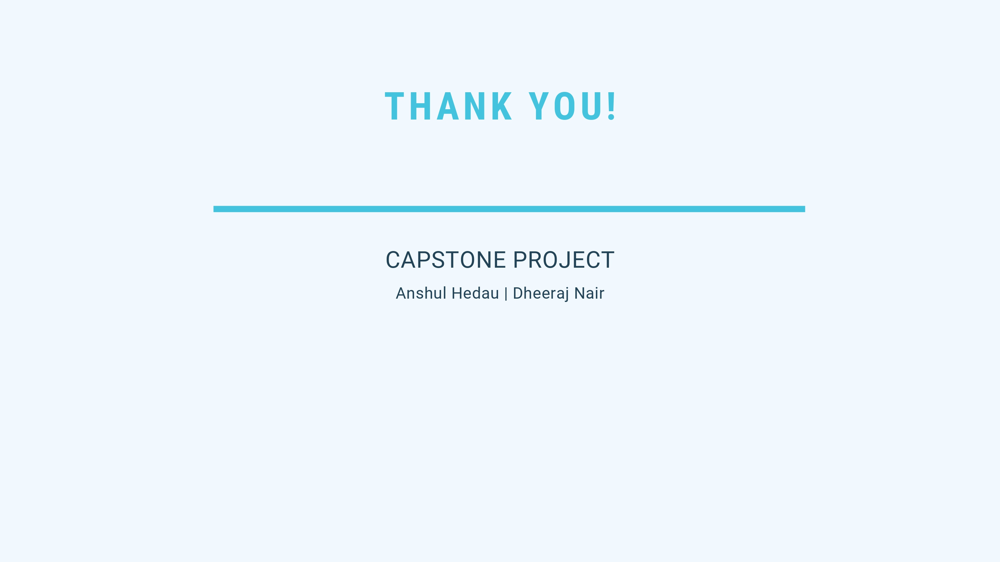

# Pehchaan - The Identifier

</img>

    
## Presentation

</img>

</img>

</img>

</img>

</img>

</img>

</img>

## Project details
This project was developed as part of our final year project of B.Tech - Computer Science at Vellore Institute of Technology, Vellore. The group consisted of [Anshul Hedau](https://www.linkedin.com/in/anshul-hedau) and [Dheeraj Nair](https://www.linkedin.com/in/dheeraj1998).
