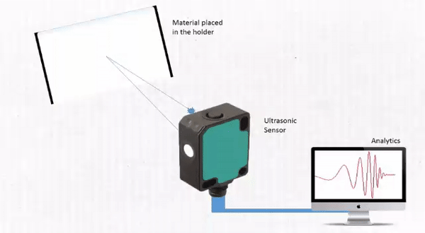

# Pehchaan - The Identifier

_Pehchaan_ is the Hindi term for *"recognise"*. 

In this project, we devise a novel method for **detection of the material of an object**. This proof-of-concept consists of an ultrasonic sensor being kept at an established distance from the material. The various steps in this method include: 
- **Data acquisition & visualisation module**: The data is collected and analyzed to establish several features on which the signal varies for different materials. 
- **Machine learning module**: These are fed into an SVM algorithm which is able to predict the material with considerable accuracy. 
- **Consumer module**: A companion mobile application has been developed which would allow the user to directly see the predictions.

## Component diagram

</img>

## Experimental setup

</img> </img>

## Android application

## Results

## Other details
This project was developed as part of our final year project of B.Tech - Computer Science at Vellore Institute of Technology, Vellore. The group consisted of [Anshul Hedau](https://www.linkedin.com/in/anshul-hedau) and [Dheeraj Nair](https://www.linkedin.com/in/dheeraj1998).
