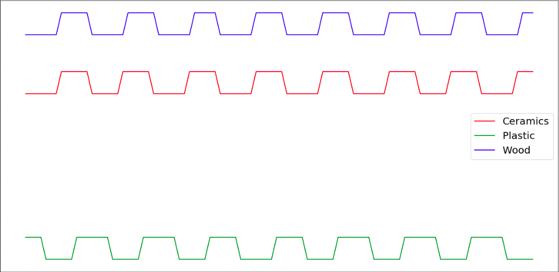
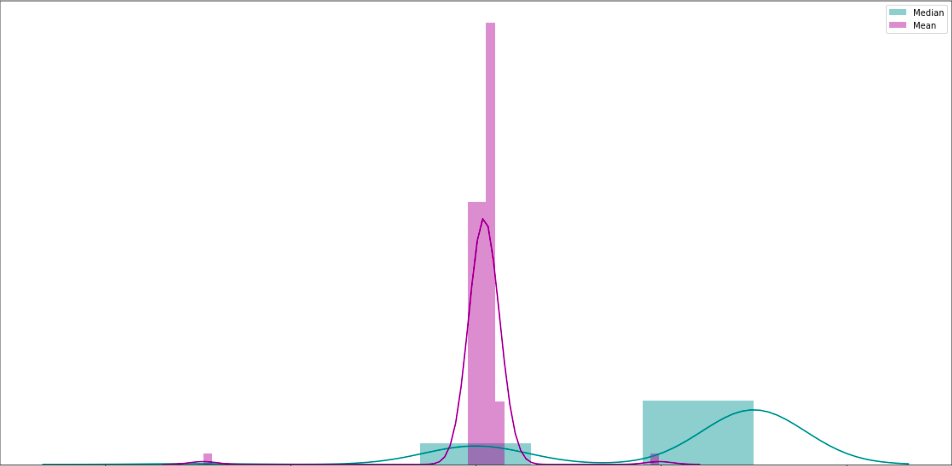

# Pehchaan - The Identifier

</img>

_Pehchaan_ is the Hindi term for *"recognise"*. 

In this project, we devise a novel method for **detection of the material of an object**. This proof-of-concept consists of an ultrasonic sensor being kept at an established distance from the material. The various steps in this method include: 
- **Data acquisition & visualisation module**: The data is collected and analyzed to establish several features on which the signal varies for different materials. 
- **Machine learning module**: These are fed into an SVM algorithm which is able to predict the material with considerable accuracy. 
- **Consumer module**: A companion mobile application has been developed which would allow the user to directly see the predictions.

## Associated files
1. **[API Interface (Flask)](https://github.com/Dheeraj1998/Pehchaan/tree/master/API_Interface_Flask)**: This folder contains the files associated with the development of the web API which is being hosted on Heroku. It also contains the trained machine learning model as a pickle file.

2. **[Data Acquisition (Arduino)](https://github.com/Dheeraj1998/Pehchaan/tree/master/Data_Acquisition_Arduino)**: This folder contains the *.ino* file which is loaded in the Arduino board to allow for the collection of the related datasets.

3. **[Data Analysis (Python)](https://github.com/Dheeraj1998/Pehchaan/tree/master/Data_Analysis_Python)**: Various files related to the analysis of the collected data from the acquisition module. The various files in this folder include:
   - **[datasets](https://github.com/Dheeraj1998/Pehchaan/tree/master/Data_Analysis_Python/datasets)** - This folder contains all the acquired datasets for the different materials.
   - **[Data Acquisition.ipynb](https://github.com/Dheeraj1998/Pehchaan/tree/master/Data_Analysis_Python/Data%20Acquisition.ipynb)** - This file uses the Python libraries to get data from the serial port of Arduino board and store them in CSV files.
   - **[Data Classification.ipynb](https://github.com/Dheeraj1998/Pehchaan/tree/master/Data_Analysis_Python/Data%20Classification.ipynb)** - The visualisation of the data, extraction of the parameters and training of SVM algorithm is done in this file.
   - **[Offline Prediction.ipynb](https://github.com/Dheeraj1998/Pehchaan/tree/master/Data_Analysis_Python/Offline%20Prediction.ipynb)** - This file allows for the offline prediction of the material with the pre-trained model.
   - **[Online Prediction.ipynb](https://github.com/Dheeraj1998/Pehchaan/tree/master/Data_Analysis_Python/Online%20Prediction.ipynb)** - This file does the required processing of the acquired data and sends them to Heroku API for prediction purposes.
   
4. **[Data Visualisation (Android)](https://github.com/Dheeraj1998/Pehchaan/tree/master/Data_Visualisation_Android)**: This folder has the consumer facing Android application which displays the confidence values for the different materials.

## Component diagram

</img>

## Experimental setup

</img> </img>

## Android application

</img>

## Results
We have identified a robust technique for the detection of the material of any object with the use of an ultrasonic sensor. The extraction of 11 different parameters formed a very important part of the analysis of the datasets to allow for successful prediction of the material with the use of any testing data. 

The below plot on the left shows the values for the different materials and the one of the right shows the distribution of mean & median for the data.

</img> </img>

## Project details
This project was developed as part of our final year project of B.Tech - Computer Science at Vellore Institute of Technology, Vellore. The group consisted of [Anshul Hedau](https://www.linkedin.com/in/anshul-hedau) and [Dheeraj Nair](https://www.linkedin.com/in/dheeraj1998).
